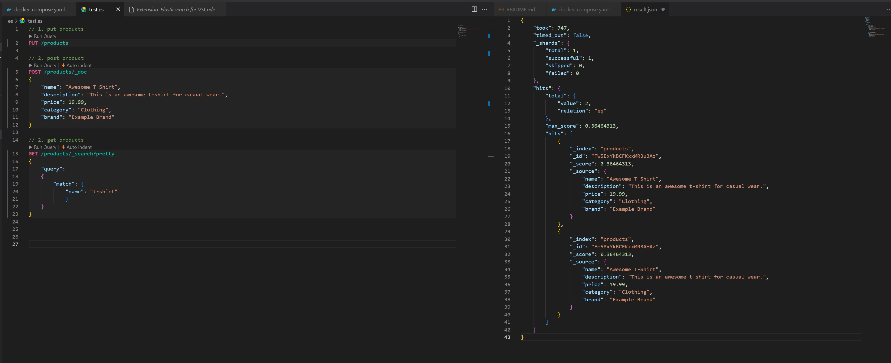
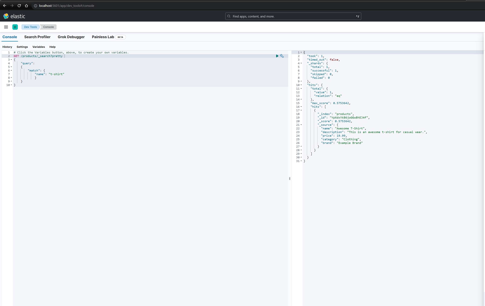
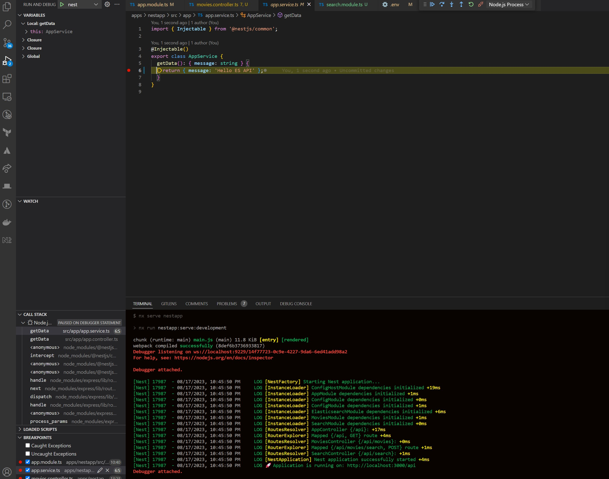
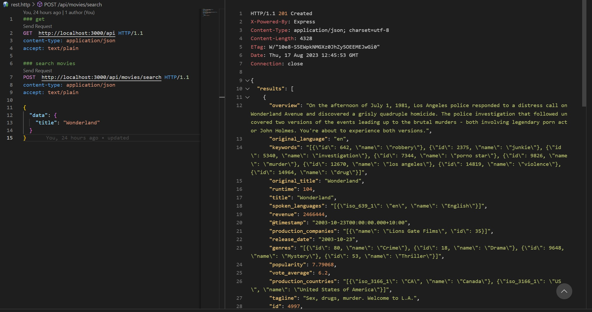

# Elastic Search + Nestjs + React Demo

## Tech Stack

- [x] elastic search
- [x] kibana
- [x] nestjs
- [x] react
- [x] Elasticsearch for VSCode
-

## Elastic Search





```javascript
# start docker
$ sudo service docker start

# stop docker
$ sudo service docker stop

# start es
$ cd es
# start docker compose
$ docker-compose up -d

# stop docker compose after use
$ docker-compose down

# test, should return {"acknowledged":true,"shards_acknowledged":true,"index":"products"}%
$ curl -X PUT http://localhost:9200/products

# start indexing products
$ curl -X POST -H 'Content-Type: application/json' -d '{ "name": "Awesome T-Shirt", "description": "This is an awesome t-shirt for casual wear.", "price": 19.99, "category": "Clothing", "brand": "Example Brand" }' http://localhost:9200/products/_doc

# get
$ curl -X GET "localhost:9200/products/_search?pretty" -H 'Content-Type: application/json' -d' { "query": { "match": { "name": "t-shirt" } } }'

# kibana http://localhost:5601

# import movies.csv
```

## Nestjs





```javascript
$ npx create-nx-workspace@latest --packageManager=yarn

$ cd org
$ nx g @nx/nest:app nestapp

$ yarn add -D @elastic/elasticsearch @nestjs/elasticsearch @nestjs/config

$ nx g resource search

$ nx g resource movies

# launch.json, set up debug mode for nestjs

```
